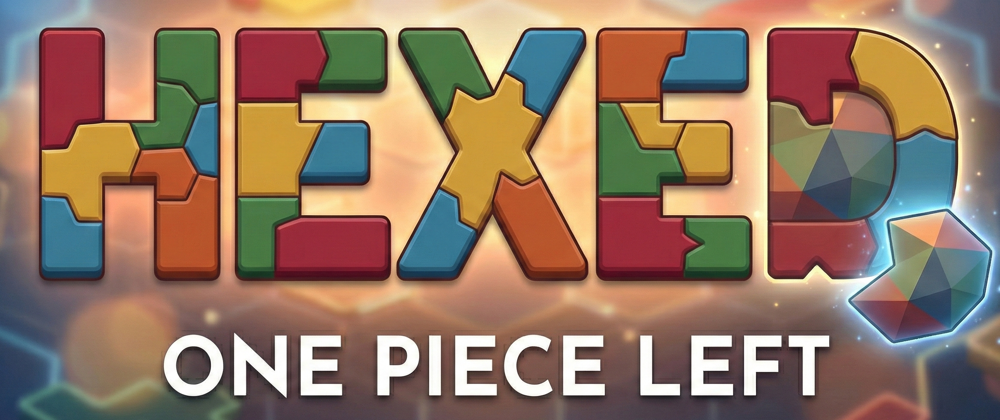

  

# Hexed: One Piece Left
## Only one piece left! It fits... until it doesn’t. Can you solve it?

Welcome to HEXED, the deceptively simple puzzle game that will challenge your spatial logic and test your patience.

The premise is easy: fit a set of colorful, geometric shapes (polyiamonds) into an hexagonal grid. No gaps, no overlaps. Just pure, satisfying geometry.

It starts calmly. You place the big pieces. The edges align perfectly. You feel like a genius. But then, you reach the end. You have one empty space remaining. You have one piece left in your hand. And it doesn’t fit.

That is the curse of HEXED.

Based on complex mathematical tiling algorithms, every level is a unique logic trap. You can’t force it; you have to solve it. One wrong move at the start can haunt you at the very end. Are you brave enough to tear it all down and backtrack?

### Features:
- Infinite Puzzles: Powered by a procedural generation engine, no two boards are ever the same.
- Deceptive Difficulty: Easy to pick up, maddening to master.
- Tactile Satisfaction: Enjoy the "snap" of pieces in a beautiful, minimalist aesthetic.
- Pure Logic: No timers, no hints, just you and the grid.

_Don't just play a puzzle. Master the geometry. Can you find the solution, or will you be left with just One Piece Left?_